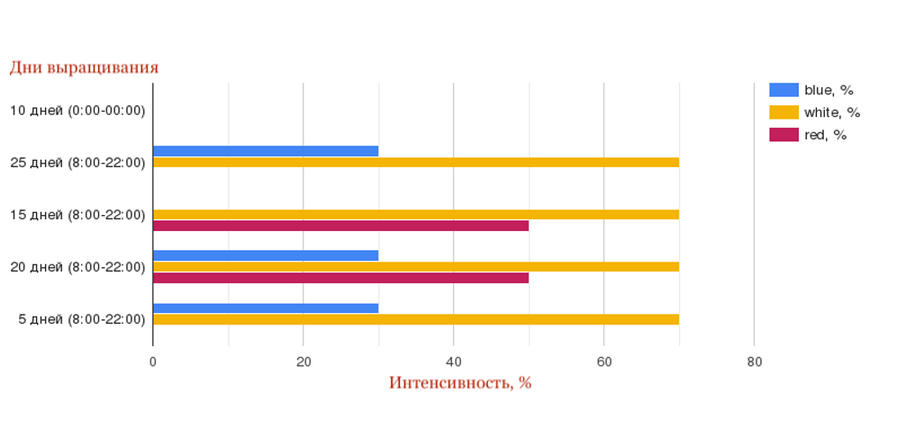

# Применение методов анализа данных для адаптивного управления автономными городскими агропроизводствами

*Данная работа была переведена на английский язык и опубликована в виде статьи в журнале Agronomy:*    
* [Analysis of Cross-Influence of Microclimate, Lighting, and Soil Parameters in the Vertical Farm](https://doi.org/10.3390/agronomy13082174)

### Цель работы
анализ взаимосвязи показателей микроклимата (температура в помещении, влажность воздуха, концентрация CO2), влажности почвы и освещения в рамках сити-фермы и их влияния на процесс фотосинтеза в растении 

### Суть эксперимента
В рамках сити-фермы исследовательского центра «Фундаментальные основы биотехнологии» РАН выращивался семенной картофель сорта "Инноватор". В ходе эксперимента собирались микроклиматические показатели (концентрация углекислого газа, влажность почвы, температура в помещении, влажность воздуха), а также фиксировались используемые сценарии освещения. Светодиодные лампы работали в красном, белом и синем спектрах свечения с разной интенсивностью (0-100%). Всего было 5 сценариев (шагов), следующих друг за другом, cверху вниз по порядку:

### Задачи
* #### [Анализ показателей влажности почвы и концентрации СО2, собранных в период эксперимента](Фурье-анализ/анализ%20зависимостей%20влажности%20почвы%20и%20co2.ipynb)

При помощи БПФ, частотной фильтрации и кросс-корреляционной функции анализируются взаимосвязи показателей влажности почвы и концентрации углекислого газа
С поливом растения (пик по влажности почвы) падает концентрация СО2. Далее, когда растение впитало воду из почвы, процесс фотосинтеза замедляется и уровень углекислого газа в помещении растет. И так как циклы полива повторяются, повторяется попеременный рост и спад влажности почвы и концентрации СО2, наблюдаемый в эксперименте. (сдвиг 55.8 часов)

* #### Анализ влияния контролируемых климатических параметров на влажность почвы
При помощи метода Permutation Importance определены ключевые микроклиматические параметры, влияющие на влажность почвы.
1. Предобработка:
    1. [Анализ данных по влажности почвы, работа со временем, нахождение средних значений](машинное%20обучение/part_1%20(анализ%20данных%20по%20влажности%20почвы,%20работа%20со%20временем,%20нахождение%20средних%20значений).ipynb)
    2. [Интерполяция и Фурье-фильтрация](машинное%20обучение/part_2%20(Интерполяция%20и%20Фурье-фильтрация).ipynb)
2. [Выбор модели обучения](машинное%20обучение/part_3%20(выбор%20лучшей%20модели%20ML).ipynb)
3. [Обучение моделей и применение метода Permutation Importance](машинное%20обучение/part_4%20(ML).ipynb)
4. [Облака точек исходных и предсказанных значения, скользящее среднее](машинное%20обучение/part_5%20(Графики%20для%20модели%202d).ipynb)       

__Интерпретация результатов:__ полученные результаты могут объясняться свойствами субстрата, добавляемого в почву: торф обладает влагоемкостью (водопоглощаемостью) и темплоемкостью. Торф имеет пористую структуру, а значит может удерживает частицы влаги. Однако, при данной характеристики с увеличением температуры также быстро может влага испаряться из субстрата.    Небольшой рост значимости концентрации СО2 может подтверждать ускорение фотосинтеза
в ходе увеличения объема торфа в почве, которое является более благоприятными для
растения с точки зрения питания.

#### Дополнительно:
* [Анализ показателей влажности почвы, микроклимата и освещения в период эксперимента](Фурье-анализ/анализ%20зависимостей%20влажности%20почвы%20и%20cвета.ipynb)        
* [Презентация к защите](data/Презентация%20ВКР.pdf)
